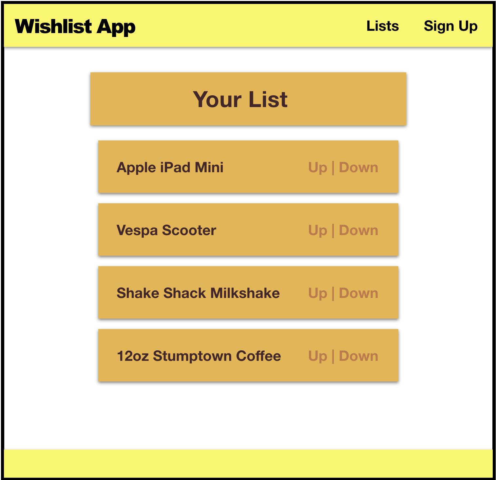
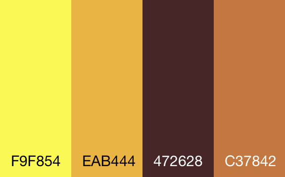

#   SOFTWARE ENGINEERING IMMERSIVE

1. Fork
1. Feature
1. Clone
1. Pull Request


# [Create React App](https://facebook.github.io/create-react-app)



## Start Here

Inside this repo, run the following command to create a new react app:

```sh
npx create-react-app wishlist-app
```

> `npx` is a tool for running JavaScript npm modules that are intended for use as commands.

Use `npm start` to start a server that will serve your new React application:

```bash
cd wishlist-app
npm start
```

You can view the app at `http://localhost:3000`

> Note: If you ever need to stop the server, you can hit `ctrl-c` in the terminal window.

Your job will be to implement the following:

1. A Header component
1. A List component
1. An Item component
1. A Footer component

Your App component will have three children: Header, List, and the Footer component.
The List component will have a child component, the Item component that will render the list item along with any votes that the item has gotten.
It will also have a `handleItemUpVote` and `handleItemDownVote` method that will be passed down via props to the Item component. These methods will increase or decrease the votes for the list item which should dynamically update as you click up and down.

**Bonus**
If you finish rather quickly add in a homepage component and a blog component and use Link and Route from react-router-dom to dynamically render the components depending on what url the user navigates to!

**Required**
- Your app should resemble the mockup as closely as possible.

**Tips:**
- Use Flexbox

##

<p align="center">
  
</p>
